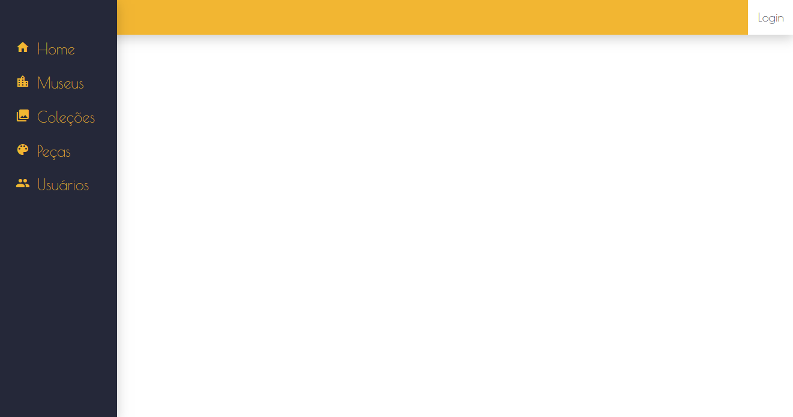

# G.A.M.A.
> Gerenciador de Acervos de Museus Acadêmicos.

O projeto surgiu através da necessidade de um gerenciador de acervos para os museus acadêmicos pertencentes à Universidade Federal de Pelotas (UFPel). Além disso, alguns softwares já existentes tinham algumas limitações ou não utilizavam de ferramentas mais atuais em seu desenvolvimento. Logo, a proposta do desenvolvimento de uma nova ferramenta com o objetivo de ser um software mais genérico e podendo ser utilizado por várias instituições tornou-se uma alternativa. O G.A.M.A. é uma ferramenta que procura mesclar um visual mais atual no desenvolvimento web e ser uma ferramenta no auxílio da gerência dos museus.



## Installation

```sh
git clone https://github.com/JonathanSias/collection-manager.git
```


## Built With

* [HTML5]()
* [CSS3]()
* [Bootstrap](https://getbootstrap.com)
* [Laravel]()
* [Postgres](https://www.postgresql.org)
* [Docker]()


## Release History

* 0.0.1
    * Work in progress


## Authors

* **Jonathan Sias** 


## License

[MIT](https://choosealicense.com/licenses/mit/)
